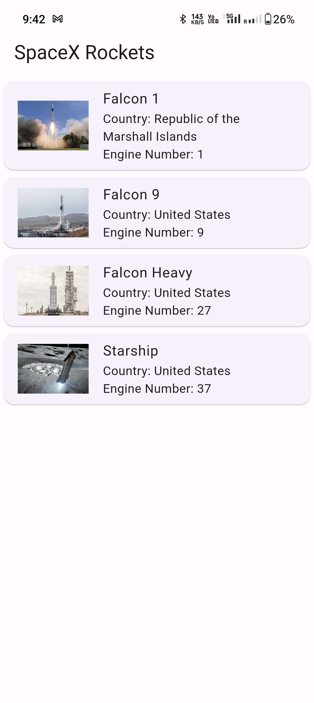
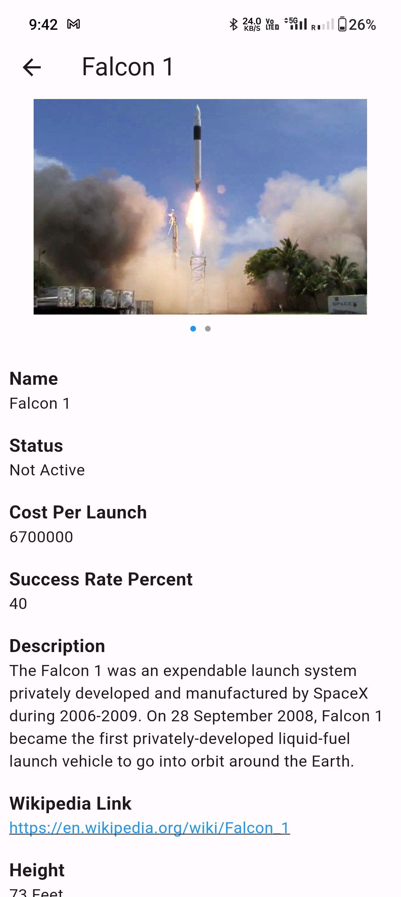
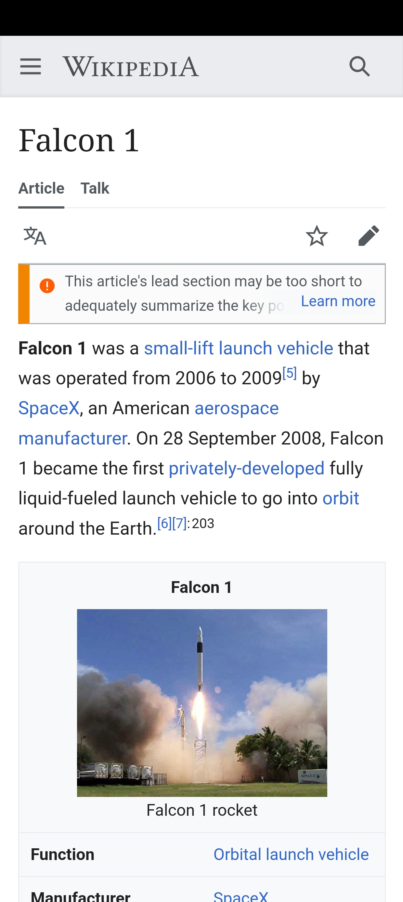

# SpaceX Rockets App

This is a Flutter application that allows users to view a list of SpaceX rockets and their details. The app fetches data from the SpaceX API and displays it in a user-friendly interface. It follows the MVVM (Model-View-ViewModel) architecture pattern and uses the Provider package for state management.

## Features

- Display a list of rockets with the following attributes:
  - Name
  - Country
  - Engines Count
  - Flicker Image

- View detailed information about a selected rocket, including:
  - Name
  - Flicker Images in a horizontal scrollable list
  - Active Status
  - Cost per launch
  - Success Rate percent
  - Description
  - Wikipedia link
  - Height & Diameter in Feet/Inches

## Installation

1. Clone the repository:

```bash
git clone https://github.com/jaydip-pawar/SpaceX-Rockets.git
```

2. Change to the project directory:

```bash
cd SpaceX-Rockets
```

3. Fetch dependencies:

```bash
flutter pub get
```

4. Run the app:

```bash
flutter run
```

## Screenshots
<div style="display: flex; gap: 16px;">
  
  
  
</div>

## Video

[Watch the demo video here](https://github.com/jaydip-pawar/SpaceX-Rockets/blob/main/screenshots/video.mp4)

## Release

You can download the release APK from the [Releases](https://github.com/jaydip-pawar/SpaceX-Rockets/releases) section of this repository.

## Project Structure

The project follows the following package structure:

- **lib**: Contains the main source code for the application.
  - **data**: Contains data-related classes, such as API services and local database services.
  - **model**: Contains the data models used in the app.
  - **repository**: Contains the repository classes responsible for fetching and managing data.
  - **res**: Contains the resources used in the app, such as images and fonts.
  - **utils**: Contains utility functions and helper classes used throughout the app.
  - **view**: Contains the UI views/screens of the app.
  - **view_model**: Contains the view models responsible for managing the app's state and data flow.
  - **main.dart**: The entry point of the application.

## Architecture

The app follows the MVVM (Model-View-ViewModel) architecture pattern:

- **Model**: Represents the data models used in the app, such as Rocket and RocketDetails.
- **View**: Contains the UI views/screens of the app, implemented as stateless and stateful widgets.
- **ViewModel**: Manages the app's state and data flow. It communicates with the repository to fetch and provide data to the views. The view models implement the business logic of the app.

The Provider package is used for state management and data sharing between the view models and views.
